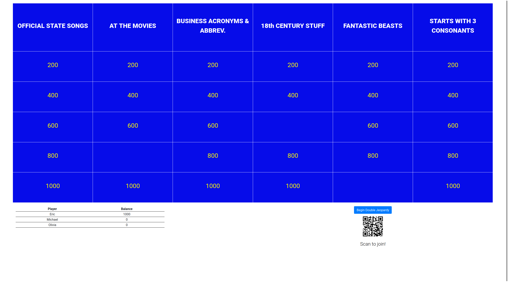
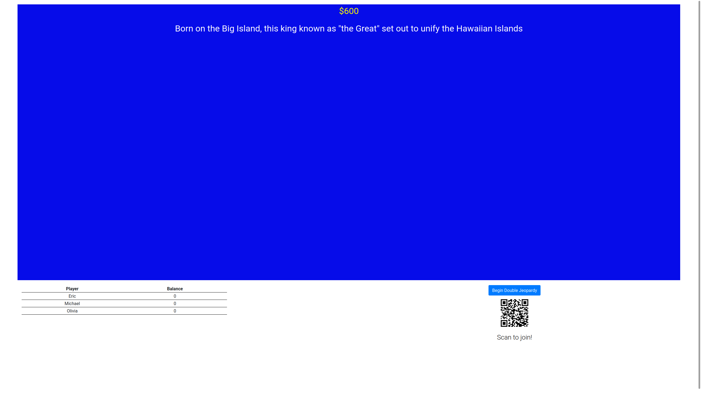
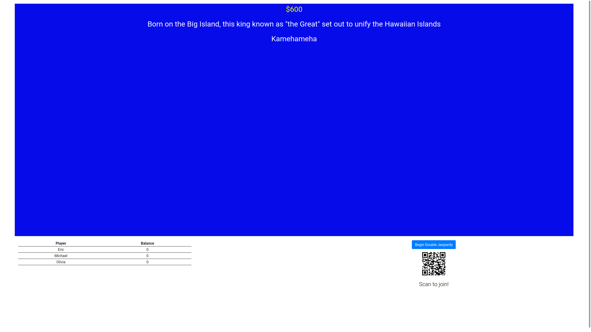
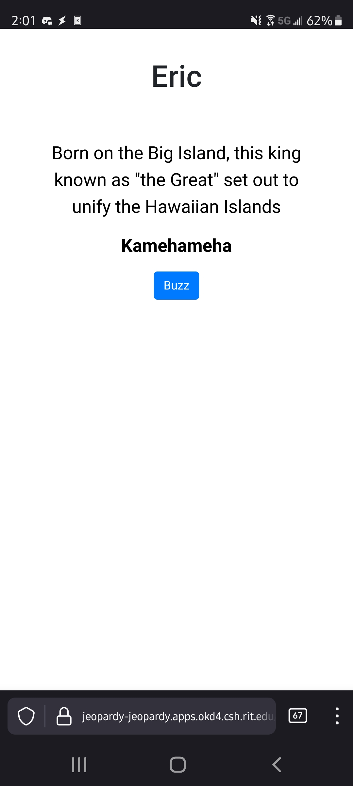

# Jeopardy


This is the frontend for a self-hosted, open source implementation of the popular game show Jeopardy. This repository includes the React frontend for the game board and a page for users to join the game and participate.

### Installation 

This repository uses **Docker** for easy installation.

```
git clone https://github.com/EricKarschner37/Jeopardy
cd Jeopardy
docker build -t jeopardy-frontend .
docker run -p 8080:8080 jeopardy-frontend
```

Please note that the installation does require an environment variable `REACT_APP_WEBSOCKET_SERVER` to be set, pointing to an installation of the Jeopardy backend (linked below). See the `Dockerfile` for an example.

### Gameplay

Each player should go to `https://<url>/play` and enter their name to join the game.

The host must use the Android app (code linked below) to manage the buzzers.

In standard Jeopardy fashion, the board contains 6 categories, each of which has 5 clues of increasing value. When the host has finished reading a clue, they should "open the buzzers" by hitting a toggle on their app. Once the buzzers are open, the first player to press the `buzz` button on their screen will have a chance to respond. The host then has the chance to mark the player's answer as correct or incorrect, based on the correct response (shown on their app). If a player gets the answer incorrect, the buzzers will immediately reopen. If the player is correct, the buzzers will close and the correct answer will be displayed.

### Images

##### Board states





##### Player states



### Related Repositories

Server - https://github.com/EricKarschner37/Go-Jeopardy

Android App - https://github.com/EricKarschner37/JeopardyApp

### Planned Future Work

- Bug fixes (of course)
- Style improvements
- Final Jeopardy
